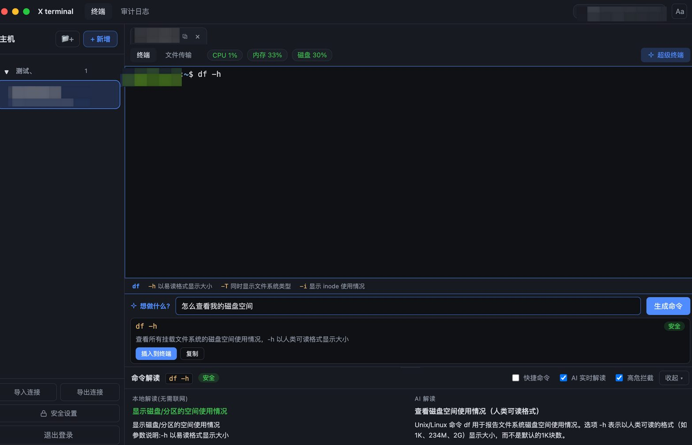

# X terminal(带 AI 命令风险提示)

一个桌面版 SSH 远程终端(基于 Electron),参考 nexus-terminal。核心特色:**输入命令时实时告诉你这条命令是什么意思、有没有风险**。

## 截图

**超级终端(自然语言转命令)+ 命令实时解读**



## 功能

- 终端:`xterm.js`,通过 WebSocket 连到后端,后端用 `ssh2` 建立真实 SSH 会话;不打印"正在连接/已连接"这类自带提示语,并且默认隐藏远端的登录横幅(MOTD,比如 Ubuntu 的 "Welcome to..." 系统信息)——这段是服务器自己发的(用 Xshell/Terminal 连同一台机器也会看到),不是我们额外加的,只是客户端把它隐藏掉,直接看到干净的 shell 提示符
- **支持同时连接多台主机,也支持给同一台主机开多个独立标签**:每连接一台就多一个会话标签,标签互不影响,切换标签不会断开其他连接(后台标签的 SSH 会话继续保持);标签上的 ⧉ 可以复制出一个新标签(同一台主机的另一个独立会话),× 单独关闭;同一台主机开了多个标签时,标签文字会自动加 #1/#2 区分;左侧主机列表用绿点标出当前"已连接但不在前台"的主机
- **命令解读面板在终端下方**(不占用左右空间),面板顶部有可拖拽的分隔条,鼠标按住上下拖可自由调整终端和解读面板的高度比例;调整后的高度会记住,刷新页面仍保留;也可一键收起/展开
- **参数速查条**:终端下方(命令解读面板上方)会实时显示当前正在打的命令有哪些常用参数,比如输入 `ls` 就会列出 `-l`/`-a`/`-h` 等参数分别是什么意思;像 `git`/`docker`/`npm` 这类有子命令的工具,输入到只有工具名时会列出子命令(`commit`/`push`/...)而不是参数。数据来自本地命令知识库,不联网、瞬时刷新,命令识别不了或清空输入时自动隐藏。
- **主机分组**:左侧主机列表可建分组、重命名、删除分组(组内主机自动归为未分组,不会被删除),新增/编辑主机时可指定分组
- **主机状态徽章**:连接主机后,「文件传输」按钮旁会显示状态——设备类型是「服务器」时每 8 秒刷新一次 **CPU / 内存 / 磁盘使用率**;设备类型是网络设备(华为/华三/飞塔/RouterOS/Aruba)时只显示品牌徽章,不采集也不显示资源占用(网络设备一般没有标准 Linux shell,采集没有意义)
- **文件传输(SFTP)**:每台主机连接后有「文件传输」子标签,支持目录浏览、新建文件夹、重命名、删除(目录递归删除)、上传单个/多个文件、**上传整个文件夹**(保留目录结构)、下载文件、**下载目录**(服务端打包为 zip 流式下载)
- 命令风险提示与解读(本地 + 大模型 混合):
  - **本地命令知识库**:内置约 140 个常见 Linux/Unix/DevOps 命令(文件操作、文本处理、进程、网络、包管理、git/docker/npm/kubectl 等)及其常用参数含义,能解析管道、`sudo` 前缀、合并短选项(如 `-rf`)、子命令(如 `git commit`/`docker run`),**完全不依赖网络**,关掉「AI 实时解读」时也能看懂命令在干什么(见 `server/src/commandDocs.ts` / `localExplain.ts`,可自行增补)
  - **网络设备命令知识库**:额外收录约 100 条网络设备命令短语,覆盖**华为/H3C 交换机(VRP)、华为 USG 防火墙(同一命令体系)、飞塔 FortiGate(FortiOS)、MikroTik RouterOS、Aruba 无线控制器/AP(ArubaOS)**,按"最长前缀短语"匹配(比如 `display current-configuration`、`config firewall policy`、`/ip firewall nat print`、`show ap database`),同样不联网,解读结果会标注具体厂商/平台(见 `server/src/networkDeviceDocs.ts`)。AI 开启时也会按同样的多厂商语境去理解,不会默认当成 Linux 命令误判。
  - **拼写纠错**:输错命令(比如把 `git` 打成 `gti`、把 `display` 打成 `dispaly`)时,本地用编辑距离在知识库里模糊匹配,AI 开启时还会给出更完整的纠正建议(如整条命令 `git status`);面板顶部会出现「💡 你是否想输入 xxx?」提示条,点「一键改正」直接把终端当前行替换成正确命令,自己确认后再回车执行
  - **本地规则引擎**:瞬时、离线,匹配 `rm -rf /`、`dd`、`mkfs`、fork 炸弹、`chmod 777`、写裸盘、关机重启、清空防火墙等高危命令并分级(安全 / 需谨慎 / 高危)
  - **AI 实时解读**:勾选「AI 实时解读」才会调用大模型网关,边打字边显示更细致的语义说明;不勾选就只用上面两项本地能力,不产生网关调用
  - **高危回车拦截**:输入高危命令按回车时,先弹确认框(含本地原因 + AI 风险说明,AI 关闭时只显示本地原因),确认后才真正执行;取消则自动发送 Ctrl-C 放弃该行
  - **模型设置**:顶部的模型徽章(显示「模型:xxx」或「⚙ 大模型设置」)点一下打开设置 → 可自定义大模型网关地址和 API Key(不再局限于 `.env` 里写死的那一个),「测试连接」能用还没保存的地址/Key 直接拉取模型列表验证是否可用,确认后下拉选择模型,保存后立即生效(存在 `data/settings.json`,不用改 `.env` 重启)。Key 输入框默认打码,点旁边的 👁 图标才显示明文。
  - **审计日志**:顶部「审计日志」标签,记录每条真正回车过的命令(时间/主机/命令/风险等级/是否执行/命中规则/AI 摘要),支持按风险等级、主机、关键词筛选
- **超级终端(自然语言转命令)**:主机子标签栏「🚀 超级终端」开关,打开后终端下方多一个输入框,用人话描述需求(比如"我需要看一下 ip 地址"),大模型会生成对应的 shell 命令(如 `ip addr show`)并附风险提示,点「插入到终端」把命令填入当前输入行(不会自动回车,仍需你自己确认执行,高危命令一样会走确认拦截)。这个功能**必须依赖大模型**,本地知识库只能"命令→解释",没法反过来"意图→命令"。默认按 Linux 命令生成,只要你在描述里提到具体设备品牌(华为交换机/USG/飞塔/FortiGate/RouterOS/Aruba 等),就会生成对应厂商的命令语法。
- **快捷命令栏**:命令解读面板里的「快捷命令」全局开关(在 AI 实时解读开关前面),勾选后所有终端会话标签都会在终端下方显示一排按钮,每个按钮对应一条你保存的常用命令(比如"看日志"=`tail -f /var/log/syslog`、"看磁盘"=`df -h`),点一下就把命令填入当前终端行(不自动回车,走正常的解读/高危拦截流程)。点「+ 管理」可新增/编辑/删除快捷命令,数据存在后端 `data/snippets.json`,所有会话共用。
- 单人本地使用:一个登录密码保护;主机的密码/私钥用登录密码派生的密钥做 AES-256-GCM 加密后存本地 `data/hosts.json`

## 命令风险:本地能实现吗?

- **可以本地实现的部分**:高危命令的「识别 + 拦截 + 分级」、以及约 140 个常见命令「这条命令大概是做什么、参数是什么意思」的解释,都用本地知识库实现,瞬时、免费、离线(见 `server/src/riskEngine.ts` 风险规则、`server/src/commandDocs.ts` + `localExplain.ts` 命令知识库,均可自行增删)。
- **需要大模型的部分**:本地知识库没收录的冷门命令/复杂组合命令的解释,以及更细致的风险研判,这类**任意输入的语义解释**本地规则覆盖不到,所以接了你的大模型网关。只有勾选「AI 实时解读」才会调用;不勾选就完全只用本地知识库,不产生任何网关请求。

## 目录结构

```
ssh工具/
├─ server/        后端 (Node + TS, express + ws + ssh2)
│  ├─ src/
│  │  ├─ index.ts        服务入口 + WebSocket 升级 + 挂载 /api/sftp
│  │  ├─ routes.ts       登录 / 主机 CRUD / 分组 CRUD / /analyze / /settings / /models / /audit
│  │  ├─ sshSession.ts   SSH 会话(WS 转发终端 I/O)
│  │  ├─ sftp.ts         SFTP 会话池(空闲5分钟自动断开)+ 递归 mkdir/删除/打包
│  │  ├─ sftpRoutes.ts   SFTP 接口:list/mkdir/rename/remove/download/upload
│  │  ├─ riskEngine.ts   本地高危命令规则库
│  │  ├─ commandDocs.ts  本地命令知识库(~140 个 Linux/Unix 命令的含义和参数说明)
│  │  ├─ networkDeviceDocs.ts 网络设备命令知识库(华为/H3C VRP、USG、FortiGate、RouterOS、Aruba,~100 条短语)
│  │  ├─ localExplain.ts 解析命令(管道/sudo前缀/短选项拆解/子命令/网络设备短语匹配)并生成本地解读
│  │  ├─ llm.ts          大模型网关调用(OpenAI 兼容,含命令分析 + 超级终端的自然语言转命令)
│  │  ├─ settings.ts     命令分析模型的持久化设置
│  │  ├─ audit.ts        审计日志存储与筛选
│  │  ├─ store.ts        主机配置存储(加密 JSON,含设备类型)
│  │  ├─ groups.ts       主机分组存储
│  │  ├─ hostStats.ts    服务器 CPU/内存/磁盘使用率采集(单次 exec 解析 /proc/stat + free + df)
│  │  ├─ crypto.ts       AES 加解密
│  │  └─ auth.ts         登录密码 + token
│  └─ .env               配置(端口 / 登录密码 / 网关)
└─ web/           前端 (Vue3 + TS + Vite + xterm.js)
   └─ src/components/  LoginView / HostList(含分组/设备类型) / TerminalView / AnalysisPanel(底部) /
                        RiskConfirmModal / SettingsModal / AuditLogView / FileManagerView /
                        SuperTerminalView(自然语言转命令) / HostStatusBadge(资源占用/设备品牌)
```

## 配置(可选)

`server/.env`(参考 `server/.env.example`)只在你想给**自己编译的安装包**预置一个默认大模型网关时才需要;不配置也完全能用,首次打开桌面客户端后可以在设置面板里手动填写网关地址和 Key。

```env
LLM_BASE_URL=https://api.openai.com/v1   # 任意 OpenAI 兼容协议的大模型网关地址
LLM_API_KEY=sk_xxxxxxxx              # 你的大模型网关 Key
LLM_MODEL=gpt-4o-mini                # 命令分析用的默认模型,可在设置面板里随时切换
```

> `.env` 已加入 `.gitignore`,不要把网关 Key 提交到仓库。桌面客户端的访问密码/免密模式与 `.env` 无关,首次打开时在应用内单独设置(见下文「数据隔离」)。

## 构建桌面客户端

```bash
git clone https://github.com/<your-username>/<your-repo>.git
cd <your-repo>
pnpm install                 # 首次(会下载 Electron 二进制)
pnpm --filter desktop start  # 本地起壳调试(不打包)

pnpm build:desktop           # 打 macOS .dmg(产物在 desktop/release/)
pnpm build:desktop:win       # 打 Windows .exe(需在 Windows 机器上执行)
```

`desktop/` 是 Electron 客户端项目(已加入 pnpm workspace),内嵌启动 `server/` 的 Node 后端,窗口加载 `web/` 编译出的前端产物,构建时会自动依次编译 `server/` → `web/` → Electron 主进程,最终打成单个安装包,不需要单独部署 `server/`/`web/`。

- **数据隔离**:桌面版把数据目录指向系统 userData(macOS 为 `~/Library/Application Support/X terminal/data`,Windows 为 `%APPDATA%\X terminal\data`),与源码仓库完全隔离。**分发出去的安装包里不含任何主机、审计、快捷命令和大模型网关信息**,首次打开会引导「设置访问密码 / 免密」。
- **随机端口**:内嵌后端用 `listen(0)` 取空闲端口,避免与本机已占用端口冲突。
- **macOS**:`pnpm build:desktop` 产出 `desktop/release/X-terminal-<版本>-<架构>.dmg`。未做 Apple 代码签名,首次打开会有"未验证开发者"提示,右键「打开」即可。
- **Windows**:在 Windows 机器上 `pnpm install && pnpm build:desktop:win`,产出 `desktop/release/X-terminal-<版本>-setup.exe`(NSIS 安装器)。同样未签名,会有"未知发布者"提示,属正常;如需消除需接入代码签名证书。详细步骤见 `desktop/WINDOWS-BUILD.md`。
- **底层机制**:`desktop/scripts/bundle-server.mjs` 用 esbuild 把 `server/dist` 打成单个 ESM 文件 `desktop/dist/server.mjs`,这样客户端不必携带 server 的 node_modules(规避 pnpm 软链打包问题)。`ssh2` 主体纯 JS,可选原生加速模块 `cpu-features` 标记为 external 不打包(有纯 JS 回退,不影响使用)。

## 使用说明

- **同时连接多台主机**:点左侧任意主机就会开一个新的会话标签(再点同一台主机只是切过去,不会重复开);每个标签的终端、命令解读、超级终端状态都是独立的;切换标签不影响其他标签的连接和已产生的输出;点标签上的 × 关闭这个连接。AI 实时解读/高危拦截这两个开关是全局的,所有标签共用。标签上的 ⧉ 可以复制出一个新标签(同一台主机的另一个独立会话)。
- **终端外观设置**:顶部 **Aa** 图标打开设置弹窗,可改字号(滑块)、字体(常见等宽字体下拉,支持自定义 CSS font-family)、行高、光标样式(块状/下划线/竖线)、光标是否闪烁。改动实时生效(所有已打开的终端一起变,不用重连),并存到本地 localStorage,重启客户端后保留。
- **命令解读面板**在终端下方,两个开关:
  - `AI 实时解读`:关掉后**不再调用大模型网关**,面板只显示「本地解读」(本地知识库)和「本地规则命中」(风险提示),开着的话会额外多一栏「AI 解读」
  - `高危拦截`:关掉后回车不再弹确认框
  - 面板右上角可「收起/展开」,收起后终端会自动占满剩余空间
- 只有本地规则判为 **高危(danger)** 的命令才会在回车时拦截;`需谨慎(caution)` 只在面板提示不拦截。可在 `riskEngine.ts` 调整规则等级。
- **本地解读覆盖不到的命令**:面板会提示"本地知识库暂未收录此命令",可以打开「AI 实时解读」补充;也欢迎直接去 `commandDocs.ts` 里加你自己常用的命令。
- **拼写纠错**:命令名疑似打错时(不管 AI 开没开)面板顶部会出现纠正提示,点「一键改正」自动清空当前行并填入正确命令,不会自己执行。
- **切换模型/网关**:点顶部的模型徽章(显示「模型:xxx」或「⚙ 大模型设置」)打开设置。网关地址和 API Key 会回显当前生效值(Key 默认打码,点 👁 显示明文);改完先点「测试连接并获取模型列表」验证能不能用,再从下拉框选模型(或选「自定义…」手填),点保存后 `/api/analyze` 立刻用新配置,无需重启服务。设置只要保存过一次网关地址/Key,就会一直使用你保存的这份,不再回退到 `.env` 里的默认值。
- **审计日志**:顶部「审计日志」标签。只有真正按过回车(执行或在确认框里点了取消)的命令才会记录;单纯打字未回车不落日志。数据存在 `data/audit.json`,最多保留最近 5000 条,超出自动丢弃最旧的。
- **主机分组**:左侧主机列表头部「📁+」新建分组;鼠标悬停分组标题可重命名/删除;新增或编辑主机时下拉选择所属分组。分组标题左侧的展开/收起三角形已调大,更容易点。
- **导入 / 导出连接(兼容 Xshell)**:左侧主机列表底部有「导入连接 / 导出连接」两个按钮。
  - **导出**:把当前所有主机各自打包成一个 `.xsh` 文件(单台直接下载,多台打包成 zip),可直接被 Xshell 导入。
  - **导入**:选择一个或多个 `.xsh` 文件(支持多选),会解析出主机名/端口/用户名/协议/备注并创建主机。**密码字段不会导入**——Xshell 的 `.xsh` 密码是其私有加密格式,无法解密,导入后请手动补填密码。导入完成会提示「已导入 N 台」及跳过的文件。
- **安全设置(改密码 / 关闭密码验证)**:左侧主机列表底部「🔒 安全设置」。
  - 密码模式下:可**修改登录密码**(需输入旧密码),或**关闭密码验证**切到免密模式。
  - 免密模式下:可**重新开启密码验证**并设置新密码。
  - ⚠️ 改密码或切换模式时,后端会用新密钥把所有已保存主机的加密凭据**重新加密一遍**(先全部解密到内存 → 全部重新加密 → 一次性写回),所以改完密码后旧主机仍能正常连接,不会丢失凭据。
- **设备类型 / 资源徽章**:新增或编辑主机时选择「设备类型」(服务器 / 华为 / 华三 / 飞塔 / RouterOS / Aruba AC-AP / 其他网络设备)。选「服务器」的主机连接后会在「文件传输」按钮旁每 8 秒轮询一次 CPU/内存/磁盘使用率(命令行内跑一次性 exec,不影响交互式终端会话);选网络设备类型的只显示品牌徽章。资源采集依赖目标是标准 Linux(`/proc/stat`、`free`、`df`),macOS 等非 Linux 系统会显示"-"(磁盘用量走 `df` 是跨平台的,通常仍能显示)。
- **文件传输**:连接主机后点顶部「文件传输」子标签。
  - 路径栏可直接输入路径回车跳转,也可点目录名逐级进入、「⬆ 上级」返回上一级
  - 「上传文件」可多选;「上传文件夹」选中一个文件夹后会保留其内部目录结构上传到当前路径下
  - 目录「下载」会在服务端打包成 zip 流式传给客户端,不占用服务器额外磁盘
  - 删除目录是递归删除,操作前会弹确认框
- **超级终端**:主机子标签栏最右侧「🚀 超级终端」按钮切换开关,开启后终端和命令解读面板之间会出现一个输入框。输入你想做的事情(中文即可)回车或点「生成命令」,大模型会给出一条命令 + 简短说明 + 本地风险标签;点「插入到终端」把命令写进当前输入行(和你自己手敲一样,会触发正常的本地/AI 解读和高危拦截逻辑),自己看清楚了再按回车执行;也可以点「复制」只拿命令文本。该功能未配置网关时会有明确提示,不会假装能用。

## 已知限制

- 当前输入行默认按键盘输入本地拼接;但 **Tab 补全** 和 **↑/↓ 翻历史命令** 这两种"内容由远端 shell 决定,不是你直接敲出来的"场景,会在发送按键后从 xterm 的屏幕缓冲区里把远端真实回显的内容读回来再分析(而不是继续用本地拼接的、补全前的片段)。`vim`/`top` 等全屏程序、`Ctrl-R` 反向搜索等更复杂的交互仍可能不精确(不影响这些程序本身运行,只影响该行的分析/拦截判断)。
- 重启客户端会丢失所有会话标签(需要重新连接,SSH 连接本身也会随窗口卸载而断开)。
- 单人本地场景:未做多用户、操作录屏等团队功能;审计日志只记录命令文本和风险判断,不含命令执行后的输出内容。
- SFTP 会话与终端会话相互独立(各自建立 SSH 连接);文件传输的 SFTP 连接空闲 5 分钟自动断开,下次操作会自动重连。
- 上传/下载走的是客户端内存(fetch + Blob),超大文件(几 GB 级)可能受内存限制,不建议用来传超大文件。
- 网络设备命令知识库按"最长前缀短语"匹配,极少数单个词在 Unix 和网络设备里含义完全不同时(目前已知只有 FortiGate 的 `set`,和 Linux shell 内置的 `set` 撞了)会优先显示 Unix 释义;`edit`/`next`/`end`/`show`/`get`/`display` 等其余词不受影响。可以直接在 `networkDeviceDocs.ts` / `commandDocs.ts` 里增补你实际用到的设备型号和命令。

## 贡献

欢迎提 Issue / PR。本地命令知识库(`server/src/commandDocs.ts`、`networkDeviceDocs.ts`)和高危规则(`server/src/riskEngine.ts`)是最容易上手贡献的部分,直接增补你用到的命令/设备型号即可。

## 开源协议

本项目基于 [MIT License](./LICENSE) 开源。

